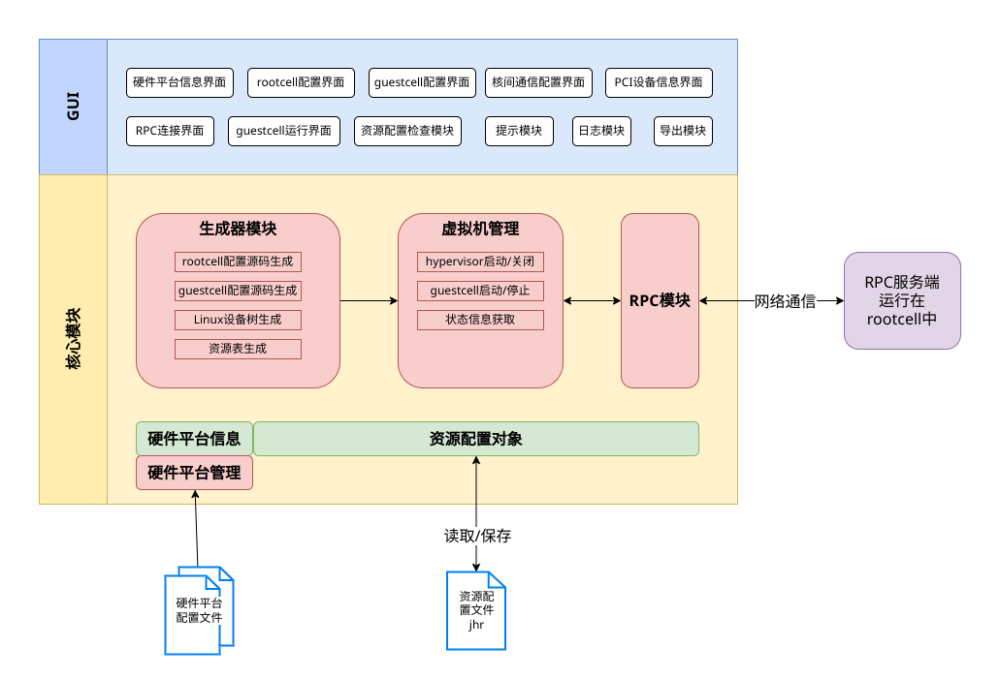

# 基于Jailhouse-gui的启动hvsior-guest-linux使用说明

## 介绍

Jailhouse-gui用于配置和管理 Jailhouse 的图形用户界面（GUI）工具，Jailhouse 是一种基于 Linux 的管理程序，可将多核处理器分割成独立单元，用于实时关键应用程序。

## 软件架构

Jailhouse-gui是一个图形界面程序，由python语言开发实现，整个软件分为两个部分，一个关注业务和数据处理的核心模块，一个是关注交互和显示的GUI模块。整个软件的功能模块架构如下图。


## 部署jailhouse虚拟化环境

### 编译Jailhouse-gui

Jailhouse-gui支持在Windows和Linux平台下运行，下面将会逐一介绍两个平台下的编译方法。

#### Linux平台下编译与打包

1、下载Jailhouse-gui的源码

```
git clone https://github.com/Jaxtonmax/Jailhouse-gui.git
```

2、安装Jailhouse-gui所需的依赖，依赖项在requirements_linux.txt文件中。

openEuler如果没有pip工具需要自行安装。若用户的openEuler已经安装好pip，按照下面的步骤继续执行。

```
cd Jailhouse-gui
pip install -r requirements_linux.txt -i https://pypi.tuna.tsinghua.edu.cn/simple
sudo apt install libxcb-xinerama0
```

3、对Jailhouse-gui进行打包

```
python3 ./build.py deploy
```

4、启动Jailhouse-gui

```
cd Jailhouse-gui/dist
./resource-tool-nonversion
```

#### Windows平台下编译与打包（修改版还没有开发Windows）

1、下载Jailhouse-gui的源码。

```
git clone https://gitee.com/openeuler/Jailhouse-gui.git
```

2、安装Jailhouse-gui所需的依赖，依赖项在requirements_win.txt文件中。

```
cd Jailhouse-gui
pip install -r requirements_win.txt -i https://pypi.tuna.tsinghua.edu.cn/simple
```

3、对Jailhouse-gui进行打包。

```
python ./build.py deploy
```

4、启动Jailhouse-gui。
双击dist目录下的resource-tool可执行文件即可。

### 使用Jaillhouse-gui

为了方便用户使用Jailhouse-gui工具快速部署jailhouse虚拟化环境，我们提供了完整的配置文件和root cell和guest cell配置文件及其相关镜像文件，用户可通过jailhouse-gui工具直接使用。

提供的文件清单如下：

| 名称             | 简介                                                                                                                                                               | 路径                   |
| :--------------- | :----------------------------------------------------------------------------------------------------------------------------------------------------------------- | ---------------------- |
| Seaway.jhr    | 提供一套完整的root cell和guest cell的配置条目，<br />使用Jailhouse-gui工具直接打开，通常用户不用<br />修改此配置文件。                                             | Jailhouse-gui/examlpes |

Jailhouse-gui需要和目标机上的rpc_server服务配合使用，并且需要对目标机的内核所能使用的内存做限制。例如：可以通过在系统启动参数中添加"mem=3G"(具体限制到多大需根据目标机的内存的实际大小进行调整)，来达成此目的。其次需要在目标机上启动rpc_server服务。

#### 部署rpc_server服务(openEuler边缘/服务器版本)

1、将threevms文件夹拷贝到目标机上。
2、安装rpc_server需要的依赖。

```
yum install -y python3-devel python3-mako
cd rpc_server
pip3 install -r requirements_rpc.txt -i https://pypi.tuna.tsinghua.edu.cn/simple
pip3 install psutil==5.9.4 -i https://pypi.tuna.tsinghua.edu.cn/simple
```
3、启动rpc_server，可让其后台运行。

```
python3 server_host.py &
```

#### 部署rpc_server服务(openEuler Embedded版本)

1、需要在编译的文件系统中包含有如下软件包。

```
python3 
python3-pip 
python3-mako 
python3-certifi 
python3-dev 
python3-psutil
ca-certificates 
flex 
bison 
bc 
rsync 
```

2、将rpc_server文件夹拷贝到目标机上。
3、安装rpc_server需要的依赖。

```
cd rpc_server
pip3 install -r requirements_rpc.txt -i http://mirrors.aliyun.com/pypi/simple/ --trusted-host mirrors.aliyun.com
```

4、将rpc_server/jailhouse_bin中的软连接指向正确的jailhouse文件。
5、启动rpc_server，可让其后台运行。

```
python3 server_host.py &
```

## 参与贡献

1. Fork 本仓库JAILHOUSE_CONFIG_REVISION
2. 新建 Feat_xxx 分支
3. 提交代码
4. 新建 Pull Request
